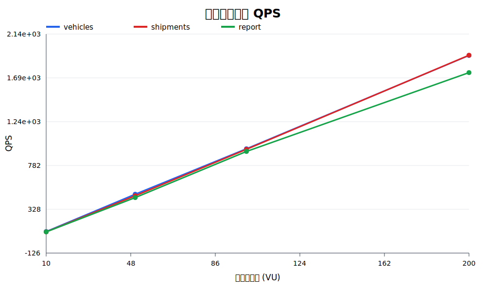
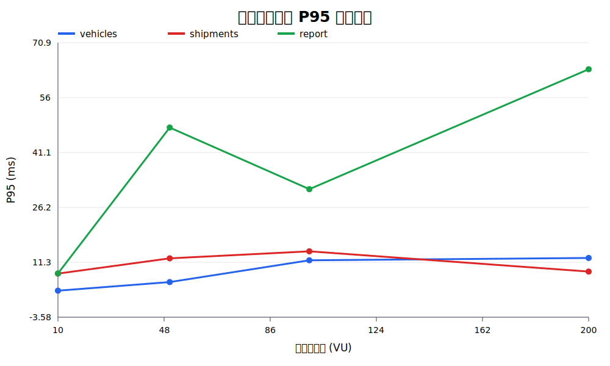
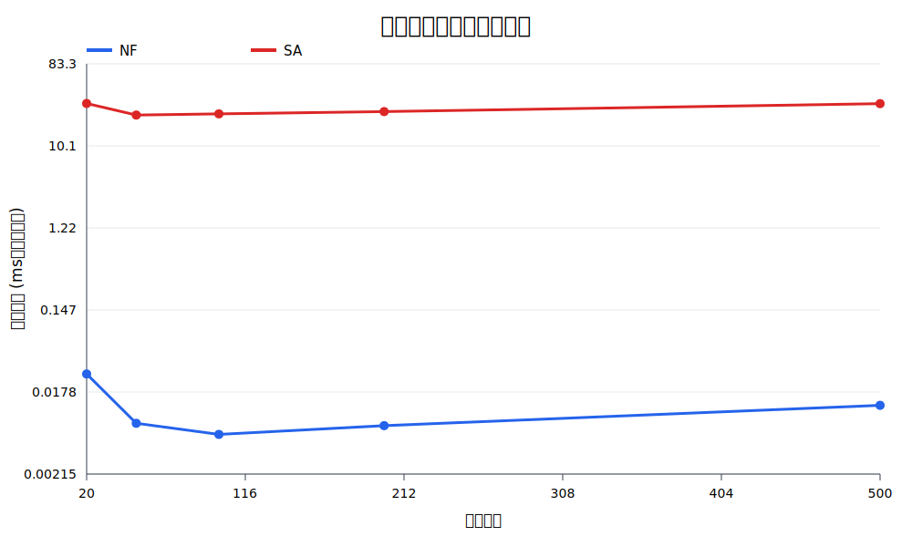
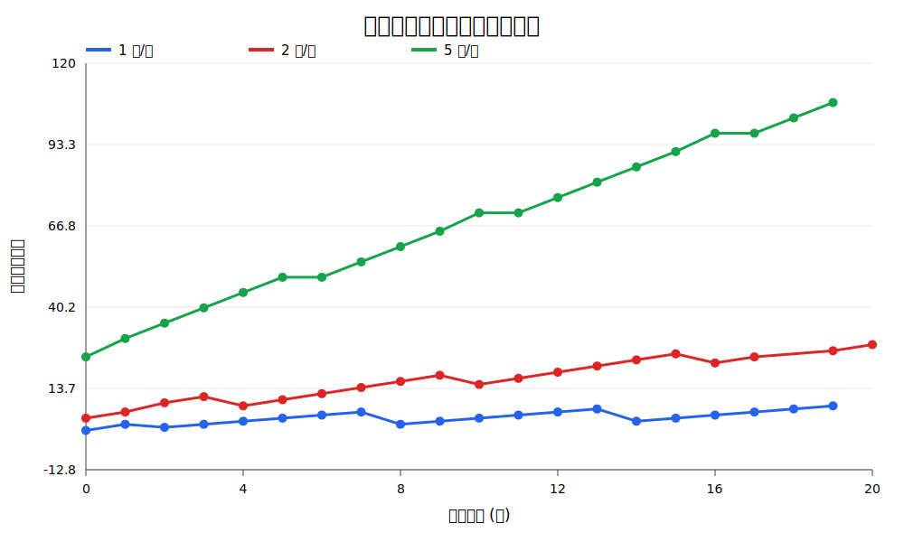

# Mover 核心压力测试报告

## 1. 测试目的

本次测试面向课程实验和答辩展示，不以工业级容量评估为目标，主要回答三个问题：

1. 核心查询接口随并发用户增加时，QPS 和响应时间如何变化。
2. 车辆数量增加时，NF 与模拟退火（SA）的调度计算耗时如何变化。
3. 持续发单超过调度处理速度后，待调度订单是否会产生积压。

## 2. 测试环境

| 项目 | 环境 |
|---|---|
| 测试日期 | 2026-06-28 |
| 测试方式 | 本机、回环地址 `127.0.0.1` |
| CPU | Apple M4 |
| Go | 1.25.1 |
| k6 | 2.0.0 |
| 后端 | Gin + GORM + MySQL + Redis |
| 初始业务数据 | 6 辆车辆、3 笔运单、3 个 POI、3 类货物 |

测试时后端与 k6 在同一台机器运行，因此结果适合用于不同参数间的相对比较，不代表独立压测机和生产部署下的容量。

## 3. 测试内容与步骤

### 3.1 接口并发测试

测试接口：

- `GET /vehicles`
- `GET /shipments`
- `GET /report/realtime`

每个接口依次使用 10、50、100、200 个虚拟用户，每档运行 5 秒。每个虚拟用户请求后暂停 100 ms，用于模拟看板用户的连续查看行为，并避免本机客户端临时端口先于服务端耗尽。

记录指标：QPS、平均响应时间、P95 响应时间、HTTP 失败率、业务失败率。

本系统数据库错误也会通过 HTTP 200 返回，因此必须额外检查响应 JSON 中的 `code`；只看 k6 的 `http_req_failed` 会漏掉真实业务错误。

### 3.2 调度算法规模测试

使用固定的 5 笔运单和相同 POI/货物数据，将车辆数设置为 20、50、100、200、500，分别测试：

- NF：按环形顺序选择首个可行车辆。
- SA：项目当前使用的模拟退火分配算法。

每组重复 3 次并取平均值。SA 的一次调用包含约 9000 次状态评估。该实验只比较算法计算开销，不包含 5 秒轮询等待、数据库写入和高德路径请求。

### 3.3 持续发单积压测试

使用 k6 分别以 1、2、5 单/秒调用 `POST /shipments/mock/1`，每档持续 20 秒；同时每秒查询一次 `GET /shipments?status=1`，记录待调度订单数量。

三档测试按顺序执行，中间保留短暂停顿，因此后一档起始积压可能略低于前一档结束值。

压测前发现模拟发单没有填写 `create_time/update_time`，MySQL 拒绝 `0000-00-00`，导致接口返回 `created=0`。修复时间字段后重新执行，最终所有发单请求均成功。

## 4. 测试结果

### 4.1 接口并发结果

| 接口 | VU | QPS | P95/ms | 平均/ms | HTTP失败率 | 业务失败率 |
|---|---:|---:|---:|---:|---:|---:|
| vehicles | 10 | 96.82 | 3.63 | 2.45 | 0% | 0% |
| vehicles | 50 | 484.00 | 5.94 | 2.58 | 0% | 0% |
| vehicles | 100 | 954.91 | 11.85 | 3.05 | 0% | 0% |
| vehicles | 200 | 1922.60 | 12.48 | 3.17 | 0% | 0.43% |
| shipments | 10 | 93.81 | 8.25 | 5.83 | 0% | 0% |
| shipments | 50 | 467.68 | 12.39 | 5.65 | 0% | 0% |
| shipments | 100 | 949.72 | 14.28 | 4.42 | 0% | 0% |
| shipments | 200 | 1924.59 | 8.79 | 3.42 | 0% | 0.55% |
| report | 10 | 93.56 | 8.28 | 6.06 | 0% | 0% |
| report | 50 | 449.26 | 47.86 | 10.72 | 0% | 12.15% |
| report | 100 | 927.43 | 31.16 | 7.03 | 0% | 12.82% |
| report | 200 | 1744.81 | 63.67 | 12.60 | 0% | 14.62% |

结论：

- `/vehicles` 和 `/shipments` 的 QPS 基本随并发数线性增长，200 VU 时约为 1900 QPS。
- `/report/realtime` 需要全量读取车辆、任务、运单、货物和 POI，压力明显高于普通列表接口。
- `/report/realtime` 从 50 VU 开始出现约 12% 的业务失败，200 VU 达到 14.62%，是本轮测试最先出现的核心瓶颈。
- 所有请求的 HTTP 失败率都是 0，但部分响应实际为业务失败，说明统一错误响应应使用合适的 HTTP 状态码，或监控业务码。
- 5 秒测试较短，P95 会有波动，因此应重点观察整体趋势和业务失败率，不对相邻档位的小幅差异作过度解释。

### 4.2 车辆规模与算法耗时

| 车辆数 | NF平均耗时/ms | SA平均耗时/ms | SA理论吞吐/单每秒 |
|---:|---:|---:|---:|
| 20 | 0.0283 | 29.98 | 166.79 |
| 50 | 0.0080 | 22.30 | 224.23 |
| 100 | 0.0060 | 22.95 | 217.90 |
| 200 | 0.0075 | 24.38 | 205.11 |
| 500 | 0.0127 | 29.85 | 167.48 |

结论：

- NF 是微秒级，SA 是 22～30 ms/批，SA 为搜索更优解付出了明显计算成本。
- 当前批次固定为 5 单，因此车辆数从 20 增长到 500 时，SA 耗时仍控制在约 30 ms，没有出现数量级恶化。
- 500 辆时 SA 比 50～200 辆时慢，体现了遍历候选车辆的额外开销。
- 表中的理论吞吐只按 `5 单 ÷ 算法计算时间` 计算；真实系统受“每 5 秒最多取 5 单”的轮询规则限制，不能达到该数值。
- 本实验没有比较 NF 与 SA 的最终 Cost、空驶里程等调度质量，因此只能说明速度差异，不能证明 NF 的整体调度效果更好。

### 4.3 持续发单积压结果

| 发单速率 | 起始待调度 | 结束待调度 | 最大待调度 | 20秒净增长 |
|---:|---:|---:|---:|---:|
| 1 单/秒 | 0 | 8 | 8 | 8 |
| 2 单/秒 | 4 | 28 | 28 | 24 |
| 5 单/秒 | 24 | 107 | 107 | 83 |

按“发单数减去净积压增长”粗略估算，系统实际处理能力约为 0.6～0.9 单/秒，与代码中“每 5 秒最多读取 5 单”的理论上限 1 单/秒基本一致。

当发单速率大于处理速率时，队列随时间持续上升；5 单/秒时 20 秒内净增加 83 单，积压最明显。这说明当前系统的主要业务吞吐限制不是 HTTP 发单接口，而是调度轮询批次和间隔。

## 5. 答辩可讲的核心结论

1. 普通查询接口在本机 200 VU 下可达到约 1900 QPS，但实时报表因为全表统计更早出现业务失败。
2. SA 在固定 5 单批次下约需 22～30 ms，明显慢于 NF，但车辆扩大到 500 时仍可完成计算。
3. 系统真实调度吞吐约 1 单/秒，持续发单超过该速度后会形成线性积压。
4. 优化优先级应是：报表统计缓存/分页、调度批次与间隔配置化、批量创建运单、错误使用正确 HTTP 状态码。

## 6. 复现与图表使用

完整命令和文件说明见 [`loadtest/README.md`](../loadtest/README.md)。原始结果和汇总 CSV 位于 `loadtest/results/`。

SVG 曲线可以直接插入新版 PowerPoint，放大不会模糊。如需自行调整颜色或字体，最方便的方法是：

1. 用 Excel 打开 `api-summary.csv`、`algorithm-summary.csv`、`backlog-summary.csv`。
2. 插入“带数据标记的折线图”。
3. 统一使用蓝、红、绿色，去掉多余背景线，保留数据标签。
4. 复制到 PowerPoint 时选择 SVG/矢量图格式。

也可以修改 `loadtest/scripts/build_report_data.py` 后重新运行，无需安装第三方 Python 包。
